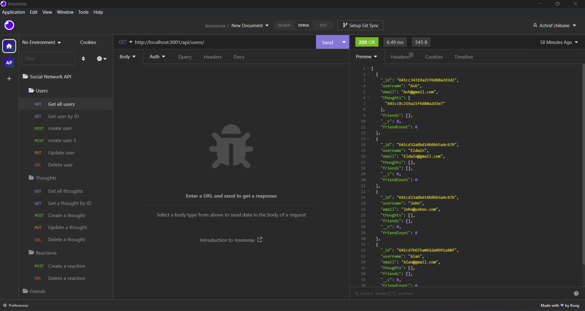
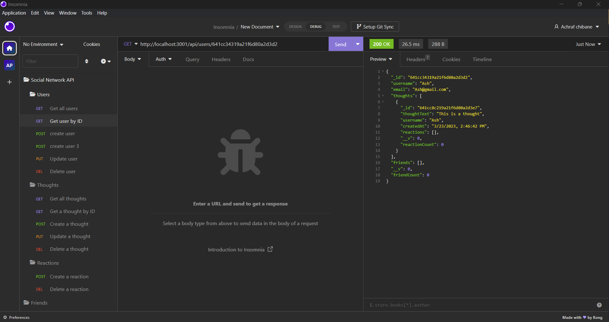
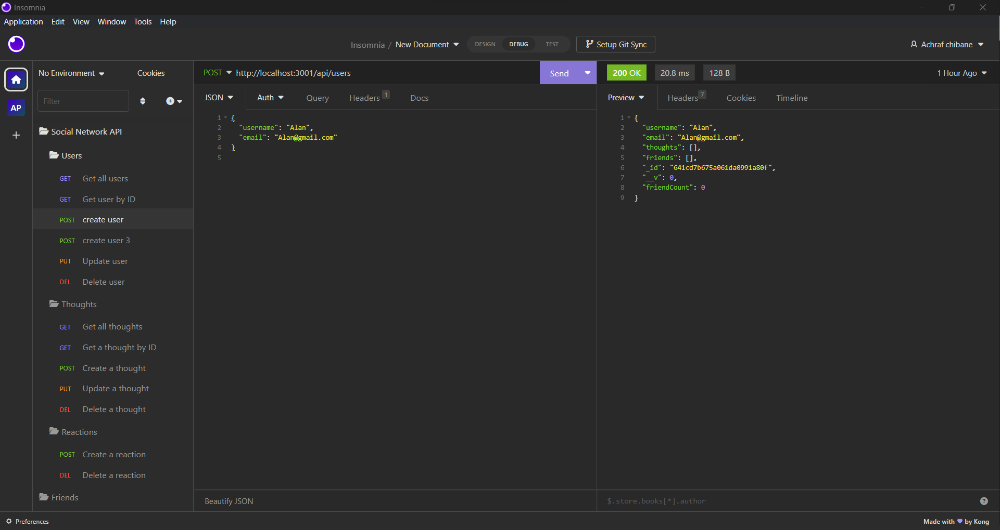
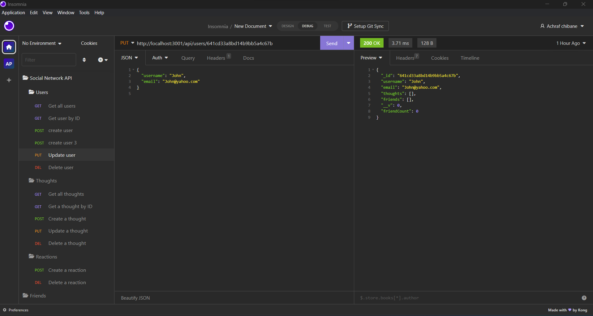
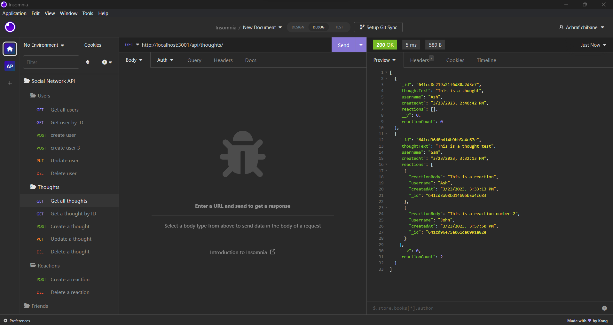

# 18-Social-Network-API

[](https://badge.fury.io/gh/yourusername%2Fyourrepo)
[](https://travis-ci.org/yourusername/yourrepo)
[](https://coveralls.io/github/Ash0422/18-Social-Network-API?branch=master)

## Table of Contents

- [Description](#description)
- [Screenshots](#screenshots)
  - [Get all users/thoughts, Get all users/thoughts by ID](#get-all-usersthoughts-get-all-usersthoughts-by-id)
  - [Create user/thought](#create-userthought)
- [Installation](#installation)
- [Usage and DEMO](#usage-and-demogit)
- [User Story](#user-story)
- [Acceptance Criteria](#acceptance-criteria)
- [Contributing](#contributing)
- [Tests](#tests)
- [Credits](#credits)
- [Questions](#questions)

## Description

A social network API is a web API that provides developers with tools to build social networking features into their applications.
It typically includes authentication, user management, posting, messaging, and other social interaction functionality.

## Screenshots






## Get all users/thoughts, Get all users/thoughts by ID


## Create user/thought


## Installation
To install the project follow these steps:
```
1- Clone the application from GitHub with:
   git clone [clone link from GitHub]
2- From the root folder, install the dependencies with:
   npm install
3- Run the app with:
   npm start
```

## Usage and DEMO.

an API for a social network web application where users can share their thoughts, react to friends’ thoughts, and create a friend list
You can also watch a video demonstration of the application [here](https://watch.screencastify.com/v/RFhQs8KLNOGiR8gkn6PH).


## User Story
```
AS A social media startup
I WANT an API for my social network that uses a NoSQL database
SO THAT my website can handle large amounts of unstructured data
```
## Acceptance Criteria
```
GIVEN a social network API
WHEN I enter the command to invoke the application
THEN my server is started and the Mongoose models are synced to the MongoDB database
WHEN I open API GET routes in Insomnia for users and thoughts
THEN the data for each of these routes is displayed in a formatted JSON
WHEN I test API POST, PUT, and DELETE routes in Insomnia
THEN I am able to successfully create, update, and delete users and thoughts in my database
WHEN I test API POST and DELETE routes in Insomnia
THEN I am able to successfully create and delete reactions to thoughts and add and remove friends to a user’s friend list
Mock-Up
```
## Contributing
Pull requests are welcome, please open an issue first to discuss what you would like to change. thank you

## Tests
This application has been tested by the creator and it works fine.<br>
this application has been uploaded to github: https://github.com/Ash0422/18-Social-Network-API <br>

## Credits
- https://www.npmjs.com/package/express
- https://www.npmjs.com/package/mongoose
- Our classes records. 

## Questions
For any additional questions, please contact me at chibane.tkd04@gmail.com or visit my GitHub profile at https://github.com/Ash0422.

